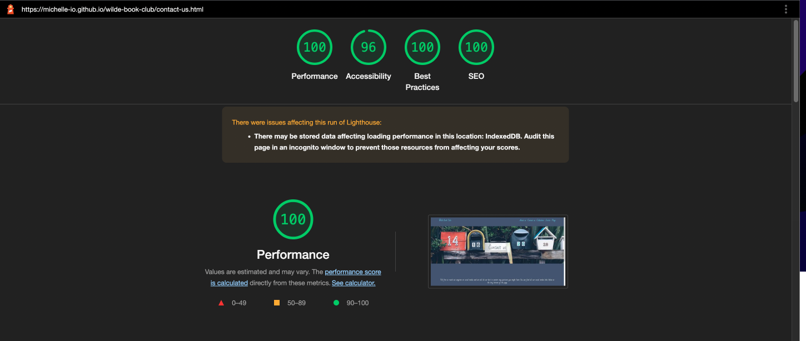
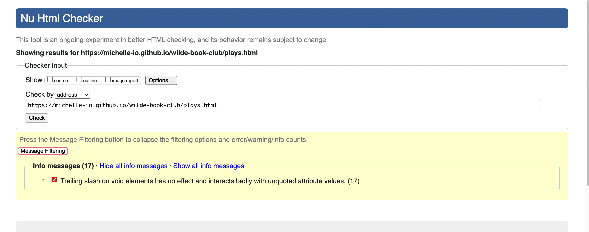

  

# Wilde Book Club

The Wild Book Club is a community brought together by the love & joy that the famous Oscar Wilde brings to our lives. The Wilde Book Club was started in 2017 & the group currently has 12 members. we are always happy for new members to join, and look forward to  hearing new ideas and opinions. This is a club for people who know and love the works of Oscar wilde and also for those who just want to learn more to learn about his works and life.

The Book Club is a reading and discussion group who meet once a week on Facebook Meet-up. This meeting takes place at 7pm on the first Friday of every month and is hosted by me (Michelle). We discuss the fascinating life of Oscar Wilde & books, plays and stories written for and by Oscar Wilde. There has also been many collections and biographies written about his life & so many other topics we delve deep on.

If you are interested in joining, get in tough with us anytime through our social media links. Have a Wilde day, Michelle

---

## **UX** 

### User stories

As a user I would like to the following:

Successfully implemented

- View information about OScar Wilde.
- View books written by Oscar Wilde.
- View plays written by Oscar Wilde.
- Find out where I can purchase Oscar Wilde literature.
- Join Oscar Wild Book Club.
- View contact information about the Book Club.

Not yet implemented

- Add Contact form to answer questions people may have.
- Add a Oscar Wilde biography page.

### Design

Color pallet

#### Icons

I used [Font Awesome](https://fontawesome.com) for the social media icons and menu bar for the mobile mobile.

#### Typography

- I used [Google Fonts](https://fonts.google.com) for the typography
  - [Bad Script](https://fonts.google.com/?query=bad+script)
  - [Major Mono Display](https://fonts.google.com/specimen/Major+Mono+Display?query=major)
  - [Philosopher](https://fonts.google.com/specimen/Philosopher?query=phil)

Google Fonts Bad Script

Google Fonts Major Mono Display 

Google Fonts Philosopher

 

#### Wireframes (Mobile)

Home page

About us page

Contact us page

Collections page

---

#### Wireframes (Desktop) 

Home page

About us page

Contact page

Collections page

---

## **Features** 

### 1. View Oscar Wilde's Books

- Users can view Oscars Wilde's written work

### 2. Purchase Books by Oscar Wild & other authors that have written books on Oscar Wilde

- Users can use links under each book that will direct the user to Amazon where they can make their purchase.

### 3. Mobile dropdown menu

- Users can easily navigate though our app with mobile dropdown menu providing links to all pages.

### 4. Social media links

- Users can contact us through Facebook, Twitter, Instagram & Facebook Messenger.

---

## **Future features**  

-  I would like to add a contact form and receive the message sent to my email.
-  I would like to add a Oscar Wild biography page where people can learn more about Oscar Wilde.

 

[🔝 Back to Top](#wilde-book-club)

---

## **Technologies** 

### Web development

- 
  - [Code editor & version control](https://code.visualstudio.com)

- 
  - [Used as version control system](https://git-scm.com)

### Front-End Technologies

- 

  - Markup language.

- 
  - Used to add style to the markup.
- 
  - Used to show navigation menu on mobile devices.

### Design

- Draw.io
  - [Used for designing wireframes](https://app.diagrams.net/) 

 

[🔝 Back to Top](#wilde-book-club)

---

## Testing 

### 1. Page speed metrics & SEO analytics

[Google page speed insight](https://pagespeed.web.dev) (Used to tests performance score)

Mobile

Home page

About us page

Contact us page

Collections page

Plays page

Stories page

---

Desktop

Home page

About us page

Contact us page

Collections page

Plays page

Stories page

 

### 2. Browser Testing

I tested my application across three major browsers: Chrome, Firefox, and Safari. I tested for the following issues.

- Screen overflow.
- Console errors.
- Accessability issues.

Home page mobile layout

Home page ipad layout

Home page desktop layout

---

### External Validation W3C Validator

#### 1. Validate HTML

[W3C Markup Validation](https://validator.w3.org/) 

**I used prettier to format my HTML & CSS which added a closing tag to the meta tags and anchor tags & caused the following warnings.**

About us page

Collections page

Contact us page

Home page

Plays page

Stories page

 

#### 2. CSS

[W3C CSS Validation](https://jigsaw.w3.org/css-validator/#validate_by_upload) 

W3C css results

 

#### 3. JavaScript

[JS Hint](https://jshint.com) 

JS Hint results

 

[🔝 Back to Top](#wilde-book-club)

---

## Deployment 

The project was deployed using GitHub pages and is live now [Wilde Book Club](https://michelle-io.github.io/wilde-book-club/) 

 

### Local Deployment 

Navigate or create a folder would like to clone the repository into & run the following command.

`git clone https://github.com/Michelle-io/wilde-book-club.git`

If you use Visual Studio Code you can add [Vite](https://marketplace.visualstudio.com/items?itemName=antfu.vite) from the market place for a better development experience.

 

---

### Remote Deployment 

There are many ways to deploy this project, however I chose GitHub pages.

#### Deploying using GitHub Pages

 To deploy to GitHub pages add the repository to your GitHub, next go to the pages option in settings & click deploy from branch button. The project will be live in a few minutes.

 

[🔝 Back to Top](#wilde-book-club)

---

## Credits 

### Content 

- [Awesome Badges](https://github.com/Envoy-VC/awesome-badges) Used to create markdown badges in the README.

### Media 

- Book information & photos
  - [Amazon](https://www.amazon.com)

#### Home page

- Banner Image & The wilde stroy paragraph
  [Oscar Wilde illustrated](https://dribbble.com/shots/15384086-Being-Wilde-The-Importance-of-Oscar?utm_source=Clipboard_Shot&utm_campaign=WalshWork&utm_content=Being%20Wilde%3A%20The%20Importance%20of%20Oscar&utm_medium=Social_Share&utm_source=Clipboard_Shot&utm_campaign=WalshWork&utm_content=Being%20Wilde%3A%20The%20Importance%20of%20Oscar&utm_medium=Social_Share)

- Stroy image
  [Pinterest](https://www.pinterest.com/pin/415105290633245810/?mt=login)

- Book shelf with lights
  - [Unsplash Janko Ferlič](https://unsplash.com/photos/sfL_QOnmy00)

- Oscar Wild sketched
  - [Unsplash Europeana](https://unsplash.com/photos/QbcupDQ9_L4)

- Oscar Wilde Statue & Oscar Wilde with cane
  -[Wikipedia](https://en.wikipedia.org/wiki/Oscar_Wilde)

#### About us page (Banner image)

- [Unsplash Tabitha Turner](https://unsplash.com/photos/vTsgVf6MF3U)
####  Contact us page (Banner image)

- [Unsplash Mathyas Kurmann](https://unsplash.com/photos/fb7yNPbT0l8)

### Collections page (Banner image)

- [Unsplash Paul Melki](https://unsplash.com/photos/bByhWydZLW0)

### Plays page (Banner image)

- [Unsplash Miro Polca](https://unsplash.com/photos/rgeEYlm5mOI)

### Stories page (Banner image)

- [Unsplash Patrick Tomasso](https://unsplash.com/photos/Oaqk7qqNh_c)

### Acknowledgements 

- A big thank you to my brother Cian, he help to resolve some issues I have & provided feedback from my project.

 

[🔝 Back to Top](#wilde-book-club)